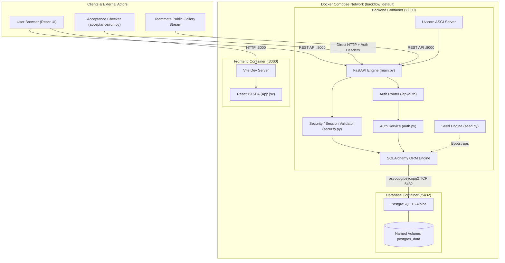
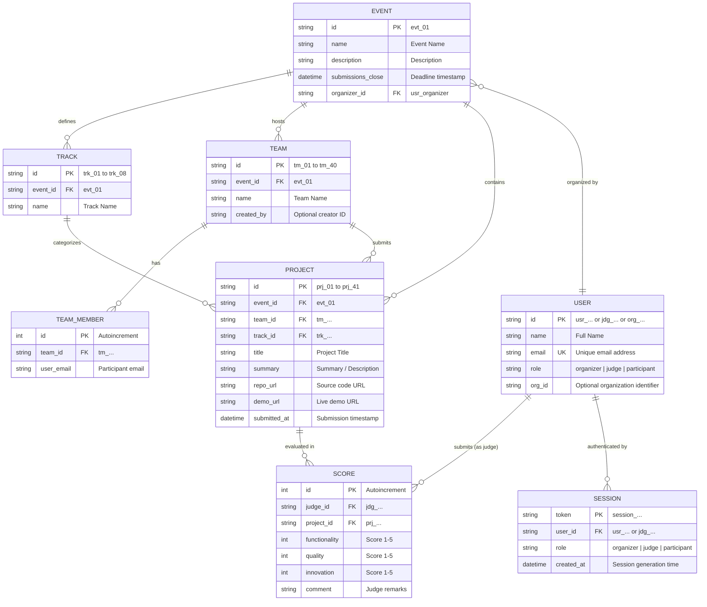
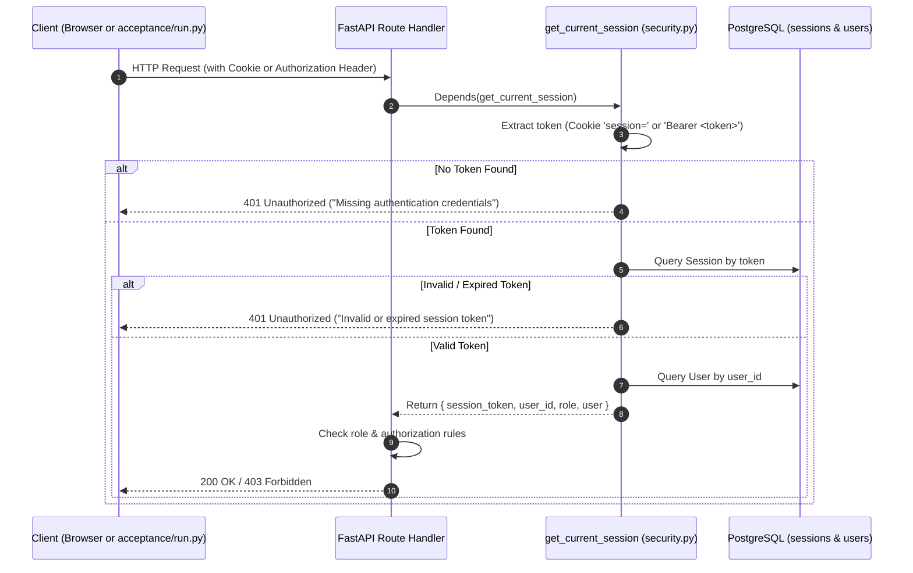
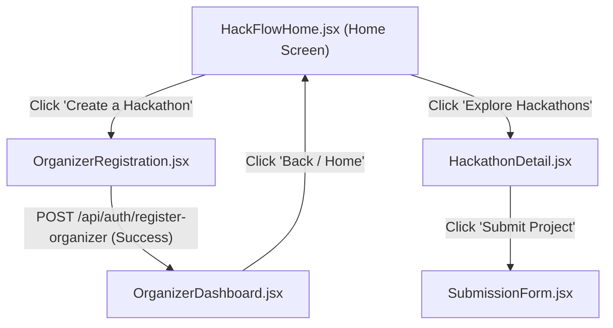

# HackFlow System Architecture & Technical Specification

> [!NOTE]
> This document provides an exhaustive, end-to-end breakdown of the current architecture of **HackFlow** as built for DOGFOOD 2026. It documents every system layer, database schema, data flow, authentication model, and testing mechanism currently in place.

---

## 1. High-Level Architecture Overview

HackFlow is built as a cloud-native, multi-container hackathon management platform. It coordinates event lifecycle management, team formation, project submissions, judging workflows, and public project galleries.

The platform comprises four primary planes:
1. **Frontend Presentation Plane** (React 19 + Vite on port `3000`)
2. **Application & API Plane** (FastAPI + Uvicorn on port `8000`)
3. **Relational Persistence Plane** (PostgreSQL 15 on port `5432`)
4. **Automated Verification Plane** (DOGFOOD 2026 `acceptance/run.py` harness)



---

## 2. Relational Database Layer (PostgreSQL 15)

The database layer serves as the single source of truth for the entire platform. It replaces all temporary in-memory dictionaries with a durable, normalized relational schema managed by SQLAlchemy.

### 2.1 Entity Relationship Diagram



### 2.2 Schema Implementation Details

| Table | Model File | Primary Key | Key Relationships / Indices |
| :--- | :--- | :--- | :--- |
| **`users`** | [user.py](file:///c:/Users/abhin/Downloads/github_repos/HackFlow/backend/app/models/user.py) | `id` (String) | `email` (Unique Index), `role` |
| **`events`** | [event.py](file:///c:/Users/abhin/Downloads/github_repos/HackFlow/backend/app/models/event.py) | `id` (String) | `organizer_id` |
| **`tracks`** | [track.py](file:///c:/Users/abhin/Downloads/github_repos/HackFlow/backend/app/models/track.py) | `id` (String) | `event_id` (Index) |
| **`teams`** | [team.py](file:///c:/Users/abhin/Downloads/github_repos/HackFlow/backend/app/models/team.py) | `id` (String) | `event_id` (Index) |
| **`team_members`** | [team_member.py](file:///c:/Users/abhin/Downloads/github_repos/HackFlow/backend/app/models/team_member.py) | `id` (Integer Auto) | `team_id` (Index), `user_email` (Index) |
| **`projects`** | [project.py](file:///c:/Users/abhin/Downloads/github_repos/HackFlow/backend/app/models/project.py) | `id` (String) | `event_id`, `team_id`, `track_id` |
| **`scores`** | [score.py](file:///c:/Users/abhin/Downloads/github_repos/HackFlow/backend/app/models/score.py) | `id` (Integer Auto) | `judge_id` (Index), `project_id` (Index) |
| **`sessions`** | [session.py](file:///c:/Users/abhin/Downloads/github_repos/HackFlow/backend/app/models/session.py) | `token` (String) | `user_id`, `role` |

### 2.3 Connection & Session Lifecycle ([database.py](file:///c:/Users/abhin/Downloads/github_repos/HackFlow/backend/app/db/database.py))
* **Database Driver**: Uses `psycopg[binary]` (psycopg v3) and `psycopg2-binary` drivers compatible with SQLAlchemy 2.0+ on Python 3.12.
* **Engine Configuration**: Configured with `pool_pre_ping=True` to immediately reconnect if idle connections drop.
* **Dependency Injection**: Route handlers request database access via the generator dependency:
  ```python
  def get_db():
      db = SessionLocal()
      try:
          yield db
      finally:
          db.close()
  ```
  This guarantees that every incoming HTTP request receives an isolated transaction that is cleanly closed upon response completion.

---

## 3. Data Ingestion & Seeding Engine ([seed.py](file:///c:/Users/abhin/Downloads/github_repos/HackFlow/backend/app/db/seed.py))

Whenever the backend container initializes, the startup command triggers `seed.py` before launching the Uvicorn web server:

```text
Container Boot → python -m backend.app.db.seed → python -m uvicorn backend.app.main:app
```

### 3.1 Seeding Workflow & Idempotency
1. **Schema Verification**: Invokes `Base.metadata.create_all(bind=engine)` to ensure all 8 physical tables exist in PostgreSQL.
2. **Idempotency Guard**: Queries `SELECT 1 FROM events WHERE id = 'evt_01' LIMIT 1`.
   * **If found**: Skips re-reading `fixtures.json` to prevent duplicate primary key collisions and preserve data mutations.
   * **If not found**: Parses [data/fixtures.json](file:///c:/Users/abhin/Downloads/github_repos/HackFlow/data/fixtures.json) and sequentially populates:
     * 1 Event (`Sample Hack 2026`, deadline `2026-03-01T18:00:00Z`)
     * 8 Tracks (`trk_01` to `trk_08`)
     * 30 Judges (`jdg_01` to `jdg_30` into `users` with `role = 'judge'`)
     * 40 Teams (`tm_01` to `tm_40`)
     * Team members (`team_members` linking member email addresses to team IDs)
     * 41 Projects (`prj_01` to `prj_41`)
     * 126 Judge Scores (`scores`)
3. **Acceptance Identity Provisioning**: Ensures the four deterministic test identities exist in `users` and `sessions`.
4. **Credential Output**: Prints the formatted TOML authentication block to `stdout` for inspection in container logs.

---

## 4. Dual-Mode Authentication & Authorization Model

HackFlow accommodates two distinct user authentication paradigms:
1. **End-User Browser Paradigm** (Interactive UI flow)
2. **Acceptance Checker Paradigm** (Headless HTTP header attachment)



### 4.1 The Four Seeded Acceptance Identities

| Role Identifier | User ID | Email | Deterministic Session Token | Purpose in Acceptance Testing |
| :--- | :--- | :--- | :--- | :--- |
| **`organizer`** | `usr_organizer` | `organizer@example.org` | `session_org_hackflow_2026_token` | Authorized for results CSV export (`/api/export.csv`) and event configuration. |
| **`judge_a`** | `jdg_08` | `marek.nowak@example.org` | `session_jdg_a_hackflow_2026_token` | Primary judge. Verified to read their own assigned scores. |
| **`judge_b`** | `jdg_03` | `priya.nair@example.org` | `session_jdg_b_hackflow_2026_token` | Peer judge. Must be blocked (401/403) from inspecting Judge A's score endpoint. |
| **`participant`**| `usr_participant`| `priya1@example.org` | `session_prt_hackflow_2026_token` | Regular participant. Blocked from judge endpoints; blocked with 4xx when submitting late. |

### 4.2 Credential Header Format
The acceptance harness attaches credentials as HTTP request headers. [backend/app/core/security.py](file:///c:/Users/abhin/Downloads/github_repos/HackFlow/backend/app/core/security.py) parses both:
* Standard Cookie header: `Cookie: session=<token>`
* Bearer header: `Authorization: Bearer <token>`
* Direct raw cookie / auth string fallbacks

---

## 5. Backend Service Architecture ([backend/app/](file:///c:/Users/abhin/Downloads/github_repos/HackFlow/backend/app/))

The backend follows a layered architecture separating routing, validation, business logic, and database transactions:

```text
Request → API Router (api/) → Pydantic Validation (schemas/) → Service Layer (services/) → ORM Models (models/) → PostgreSQL
```

### 5.1 Active Routing & Services
* **`api/auth.py`**:
  * `POST /api/auth/register-organizer`: Accepts `name`, `email`, `org_id`. Injects `db: Session`, delegates to `AuthService.register_organizer`, creates a `User` record in PostgreSQL with role `organizer`, and returns a serialized `UserResponse`.
  * `GET /api/auth/me?email=...`: Queries the database for existing user records by email.
* **`services/auth.py`**:
  * Executes database queries against `User` models, eliminating previous in-memory state.
* **`schemas/auth.py`**:
  * Defines Pydantic validation schemas with `Config.orm_mode = True` for SQLAlchemy serialization.

### 5.2 Planned Routes for T1 & T2
* **`api/projects.py`**:
  * `GET /projects` (or `/api/events/{id}/gallery`): Public gallery endpoint returning projects from PostgreSQL.
  * `POST /projects/new` (or `/api/events/{id}/projects`): Project submission checking the event's `submissions_close` deadline.
* **`api/judging.py`**:
  * `GET /api/judge/scores`: Returns scores where `judge_id == session.user_id`. Blocks access if a different judge query parameter or unauthorized role is supplied.
* **`api/results.py`**:
  * `GET /api/export.csv`: Validates organizer authorization, calculates project aggregations, and streams a formatted CSV.

---

## 6. Frontend Presentation Layer (React 19 + Vite)

The frontend is a single-page application built with React 19, Lucide React icons, and modern glassmorphism styling.

### 6.1 Page Routing & State Flow ([App.jsx](file:///c:/Users/abhin/Downloads/github_repos/HackFlow/frontend/src/App.jsx))
Routing is managed via declarative state in `App.jsx`, maintaining high responsiveness without heavy external routing dependencies:



### 6.2 Browser Persistence
* When an organizer registers via `OrganizerRegistration.jsx`, user metadata is saved to `localStorage.getItem("hackflow_user")`.
* On page reload, `App.jsx` reads `localStorage` to restore session state, keeping the user logged into the Organizer Dashboard until they click "Log Out".

---

## 7. Acceptance Test Harness Mechanics ([acceptance/run.py](file:///c:/Users/abhin/Downloads/github_repos/HackFlow/acceptance/run.py))

The official test suite evaluates whether the system satisfies the DOGFOOD 2026 tiers.

### 7.1 Execution Contract
```bash
python run.py .dogfood.toml > acceptance-report.txt
```

### 7.2 Tier Matrix & Evaluation Logic

```text
┌────────────────────────────────────────────────────────────────────────┐
│ T1 Requirements                                                        │
├───────────────────────┬────────────────────────────────────────────────┤
│ gallery is public     │ GET routes.gallery (no auth) == 200            │
│ project from fixtures │ Response body contains "Glass Signal",         │
│                       │ "Small Meadow", or "Deep Compass"              │
│ deadline enforcement  │ POST routes.submit (participant auth) == 4xx   │
├───────────────────────┴────────────────────────────────────────────────┤
│ T2 Requirements                                                        │
├───────────────────────┬────────────────────────────────────────────────┤
│ judge sees own scores │ GET routes.judge_scores (judge_a auth) == 200  │
│ score isolation       │ GET routes.peer_scores (judge_b auth) == 401/403│
│ participant blocked   │ GET routes.judge_scores (participant) == 401/403│
│ csv export works      │ GET routes.csv_export (organizer auth) == 200  │
│                       │ AND first line contains a comma (',')          │
└───────────────────────┴────────────────────────────────────────────────┘
```

> [!IMPORTANT]
> The acceptance checker never modifies data or logs in interactively. It expects the portal to be pre-seeded upon boot and verifies endpoints against the configuration in `.dogfood.toml`.

---

## 8. Docker Runtime & Container Topology

The entire ecosystem is containerized through Docker Compose:

| Container Name | Service | Base Image | Host Port | Target Port | Role / Health Check |
| :--- | :--- | :--- | :--- | :--- | :--- |
| **`hackflow-db`** | `db` | `postgres:15-alpine` | `5432` | `5432` | Relational store. Health: `pg_isready -U hackflow_user -d hackflow_db` |
| **`hackflow-backend`** | `backend` | `python:3.12-slim` | `8000` | `8000` | FastAPI server. Waits for `db` healthy; runs `seed.py` on boot. |
| **`hackflow-frontend`** | `frontend` | `node:20-alpine` | `3000` | `3000` | Vite dev server serving the React 19 SPA. |

### Volume Persistence
* The named volume **`postgres_data`** (`/var/lib/postgresql/data`) retains database tables, registered organizers, and score modifications across restarts.

---

## 9. Comprehensive Codebase Map

```text
HackFlow/
├── .env                              # Active environment configuration (Postgres credentials & ports)
├── .env.example                      # Template environment variables
├── docker-compose.yml                # Docker multi-container definition (db, backend, frontend)
├── data/
│   └── fixtures.json                 # Authoritative hackathon dataset (DO NOT MODIFY)
├── acceptance/
│   ├── run.py                        # Authoritative test checker (DO NOT MODIFY)
│   ├── example.dogfood.toml          # Official reference configuration template
│   ├── .dogfood.toml                 # Active configuration (populated when claiming tiers)
│   └── acceptance-report.txt         # Output artifact of run.py executions
├── backend/
│   ├── Dockerfile                    # Python 3.12 container definition with build dependencies
│   ├── requirements.txt              # FastAPI, SQLAlchemy, Pydantic, psycopg, uvicorn
│   └── app/
│       ├── main.py                   # FastAPI application factory, CORS, and root router
│       ├── core/
│       │   ├── config.py             # Settings and environment configuration
│       │   ├── security.py           # Session extraction, cookie parsing, and auth dependencies
│       │   └── permissions.py        # Role-based access control helpers
│       ├── db/
│       │   ├── database.py           # SQLAlchemy engine, SessionLocal, and get_db dependency
│       │   └── seed.py               # Fixture importer & deterministic acceptance credential generator
│       ├── models/                   # SQLAlchemy ORM table definitions
│       │   ├── user.py               # users table
│       │   ├── event.py              # events table
│       │   ├── track.py              # tracks table
│       │   ├── team.py               # teams table
│       │   ├── team_member.py        # team_members table
│       │   ├── project.py            # projects table
│       │   ├── score.py              # scores table
│       │   └── session.py            # sessions table
│       ├── schemas/                  # Pydantic request/response models
│       │   └── auth.py               # OrganizerRegisterRequest, UserResponse
│       ├── services/                 # Business logic and database operations
│       │   └── auth.py               # AuthService for user lookup and creation
│       └── api/                      # Route controllers
│           ├── auth.py               # /api/auth routes
│           ├── events.py             # Event management placeholder
│           ├── projects.py           # Project submissions & gallery placeholder
│           ├── judging.py            # Judge scoring & isolation placeholder
│           ├── teams.py              # Team formation placeholder
│           └── results.py            # Results & CSV export placeholder
└── frontend/
    ├── Dockerfile                    # Node 20 container running Vite dev server
    ├── package.json                  # React 19, Lucide React, Vite dependencies
    ├── vite.config.js                # Vite build and server options
    ├── index.html                    # Single-page HTML shell
    └── src/
        ├── App.jsx                   # Main layout, route state, and localStorage handler
        ├── main.jsx                  # React DOM root render
        └── pages/
            ├── HackFlowHome.jsx          # Landing page with hackathon cards
            ├── OrganizerRegistration.jsx # Organizer registration form calling /api/auth
            ├── OrganizerDashboard.jsx    # Metrics and event management dashboard
            ├── HackathonDetail.jsx       # Event details, tracks, and rules view
            └── SubmissionForm.jsx        # Project submission form
```
